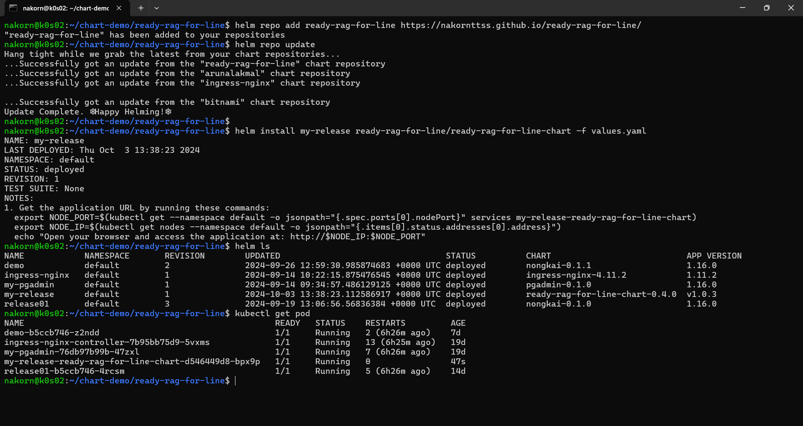
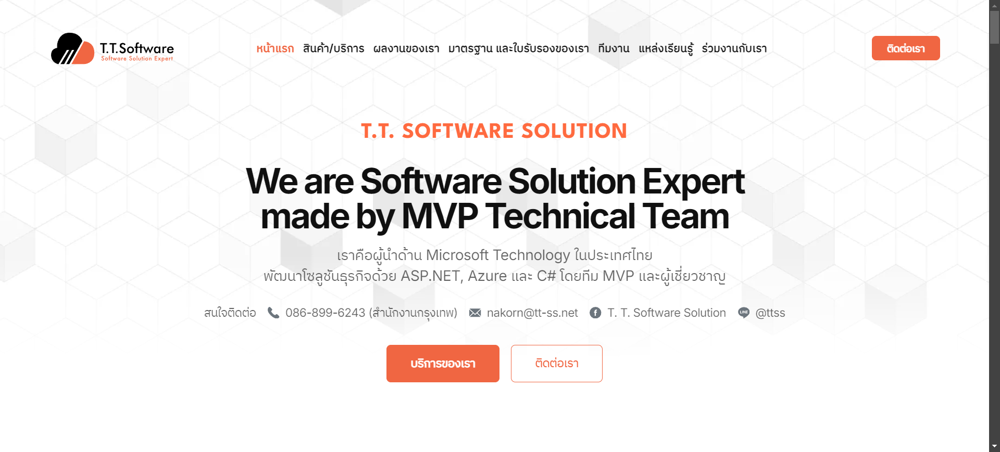

# Ready-to-Use RAG for LINE

This project provides a simple, ready-to-use Retrieval-Augmented Generation (RAG) solution for LINE messenger. It is configured to allow users to easily install and deploy using either Docker Compose or Helm in Kubernetes.


## Features

- Integration with OpenAI API for GPT models.
- LINE messaging service integration.
- Easily configurable using `docker-compose.yml` or Helm for Kubernetes.
- Supports different configurations for embedding models and FAISS index for efficient vector search.
- **Readiness and liveness probes** for Kubernetes health checking, ensuring the service is alive and ready to serve requests.
- **Support for NodePort and ClusterIP** service types for flexible deployment options in Kubernetes.
- Manual health check endpoints for readiness and liveness.


## Prerequisites

- Docker
- Kubernetes cluster (if using Helm)
- Helm installed (if using Helm)
- OpenAI API Key
- LINE Developer Access Token and Secret

## Installation

### Option 1: Docker Compose

1. Clone the repository:

   ```bash
   git clone https://github.com/nakornttss/ready-rag-for-line.git
   cd ready-rag-for-line
   ```

2. Edit the environment variables in `docker-compose/docker-compose.yml`:

   ```yaml
   version: '3.8'
   services:
     ready-rag-for-line:
       image: ready-rag-for-line
       ports:
         - "5000:5000"
       environment:
         OPENAI_API_KEY: "<your_openai_api_key>"
         LINE_CHANNEL_ACCESS_TOKEN: "<your_line_channel_access_token>"
         LINE_CHANNEL_SECRET: "<your_line_channel_secret>"
         CHAT_COMPLETION_MODEL: "gpt-4o-mini"  
         CHAT_COMPLETION_TEMPERATURE: 0.7  
         OPENAI_EMBEDDING_MODEL: "text-embedding-3-small"
         VECTOR_DIMENSION: 1536
         FAISS_INDEX_PATH: "/app/faiss_data/faiss_index.bin"  
         INITIAL_TEXTS: "['T.T. Software Solution เป็นผู้เชี่ยวชาญด้านโซลูชันซอฟต์แวร์ที่สร้างขึ้นโดยทีมงาน MVP ที่มีความเชี่ยวชาญทางเทคนิค', 'เราเป็นผู้นำในด้านเทคโนโลยีของ Microsoft ในประเทศไทย โดยพัฒนาโซลูชันธุรกิจด้วย ASP.NET, Azure และ C# ด้วยทีม MVP และผู้เชี่ยวชาญ', 'หากต้องการติดต่อเรา: สำนักงานกรุงเทพฯ โทร 086-899-6243, สำนักงานขอนแก่น โทร 061-018-1275, ฝ่ายทรัพยากรบุคคล โทร 061-018-1275 หรืออีเมล hr@tt-ss.net', 'บริการพัฒนาระบบ Back Office Web Application ที่ออกแบบและพัฒนาตามความต้องการเฉพาะขององค์กร', 'บริการพัฒนาระบบ Data Visualization โดยออกแบบและพัฒนา Dashboard ที่ช่วยในการวิเคราะห์และตัดสินใจ', 'บริการให้คำปรึกษา พัฒนา และดูแลระบบบน Azure Cloud โดยทีมงานมืออาชีพ เช่น การย้ายระบบไปยัง Azure Cloud, การพัฒนาโซลูชัน, การให้คำปรึกษาและอบรม รวมถึงการดูแลระบบบน Azure Cloud', 'ผลงานภายในประเทศ: ระบบเผยแพร่ข้อมูลจัดซื้อจัดจ้างภาครัฐของกรุงเทพมหานคร บริษัทได้จัดอบรมการใช้งานระบบนี้ในวันที่ 18 กรกฎาคม 2567 และส่งงานตามกำหนดเวลา ซึ่งแสดงถึงศักยภาพของบริษัท', 'ผลงานในต่างประเทศ: พัฒนาระบบจัดการทรัพยากรในกรณีฉุกเฉิน เช่น ซ่อมแซมโครงสร้างพื้นฐานสาธารณูปโภคและการดับไฟป่า ให้กับลูกค้าใน USA', 'ผู้บริหารของบริษัท: CEO นคร เหรียญตระกูลชัย, CTO คุณป้องกัน, General Manager คุณวัชรพงษ์']"
   ```

3. Start the service using Docker Compose:

   ```bash
   docker-compose -f docker-compose/docker-compose.yml up
   ```

4. Access the service at `http://localhost:5000`.

### Option 2: Helm for Kubernetes

1. Add the Helm repository:

   ```bash
   helm repo add ready-rag-for-line https://nakornttss.github.io/ready-rag-for-line/
   helm repo update
   ```

2. Install the chart with custom values:

   ```bash
   helm install my-release ready-rag-for-line/ready-rag-for-line-chart -f /path/to/your/values.yaml
   ```

3. Access the service at `http://<node-ip>:<nodePort>` (if using NodePort) or through the cluster (if using ClusterIP).



## Configuring `values.yaml`

The `values.yaml` file is used to configure how the Helm chart is deployed. Below is an example configuration:

```yaml
image:
  repository: ghcr.io/nakornttss/ready-rag-for-line-package
  tag: "v1.0.2"
  pullPolicy: IfNotPresent

service:
  type: NodePort       # Set to 'NodePort' or 'ClusterIP' based on your deployment
  port: 5000
  nodePort: 32000      # Specify NodePort only if 'NodePort' is selected as the service type

env:
  OPENAI_API_KEY: "<your_openai_api_key>"
  LINE_CHANNEL_ACCESS_TOKEN: "<your_line_channel_access_token>"
  LINE_CHANNEL_SECRET: "<your_line_channel_secret>"
  CHAT_COMPLETION_MODEL: "gpt-4o-mini"
  CHAT_COMPLETION_TEMPERATURE: 0.7
  OPENAI_EMBEDDING_MODEL: "text-embedding-3-small"
  VECTOR_DIMENSION: 1536
  FAISS_INDEX_PATH: "/app/faiss_data/faiss_index.bin"
  INITIAL_TEXTS: "['T.T. Software Solution เป็นผู้เชี่ยวชาญด้านโซลูชันซอฟต์แวร์ที่สร้างขึ้นโดยทีมงาน MVP ที่มีความเชี่ยวชาญทางเทคนิค', 'เราเป็นผู้นำในด้านเทคโนโลยีของ Microsoft ในประเทศไทย โดยพัฒนาโซลูชันธุรกิจด้วย ASP.NET, Azure และ C# ด้วยทีม MVP และผู้เชี่ยวชาญ', 'หากต้องการติดต่อเรา: สำนักงานกรุงเทพฯ โทร 086-899-6243, สำนักงานขอนแก่น โทร 061-018-1275, ฝ่ายทรัพยากรบุคคล โทร 061-018-1275 หรืออีเมล hr@tt-ss.net', 'บริการพัฒนาระบบ Back Office Web Application ที่ออกแบบและพัฒนาตามความต้องการเฉพาะขององค์กร', 'บริการพัฒนาระบบ Data Visualization โดยออกแบบและพัฒนา Dashboard ที่ช่วยในการวิเคราะห์และตัดสินใจ', 'บริการให้คำปรึกษา พัฒนา และดูแลระบบบน Azure Cloud โดยทีมงานมืออาชีพ เช่น การย้ายระบบไปยัง Azure Cloud, การพัฒนาโซลูชัน, การให้คำปรึกษาและอบรม รวมถึงการดูแลระบบบน Azure Cloud', 'ผลงานภายในประเทศ: ระบบเผยแพร่ข้อมูลจัดซื้อจัดจ้างภาครัฐของกรุงเทพมหานคร บริษัทได้จัดอบรมการใช้งานระบบนี้ในวันที่ 18 กรกฎาคม 2567 และส่งงานตามกำหนดเวลา ซึ่งแสดงถึงศักยภาพของบริษัท', 'ผลงานในต่างประเทศ: พัฒนาระบบจัดการทรัพยากรในกรณีฉุกเฉิน เช่น ซ่อมแซมโครงสร้างพื้นฐานสาธารณูปโภคและการดับไฟป่า ให้กับลูกค้าใน USA', 'ผู้บริหารของบริษัท: CEO นคร เหรียญตระกูลชัย, CTO คุณป้องกัน, General Manager คุณวัชรพงษ์']"
```

### Service Types Supported

The Helm chart supports two types of Kubernetes services for deployment: `NodePort` and `ClusterIP`.

- **NodePort**:
  - With `NodePort`, the service will be exposed on a specific port on all nodes of the Kubernetes cluster. This is useful when you want to access the service externally.
  - The `nodePort` value must be provided (e.g., `32000`) in the `values.yaml`.
  - Access the service at `http://<node-ip>:<nodePort>`.

- **ClusterIP**:
  - This is the default service type. It exposes the service internally to the cluster. Use this when the service does not need to be accessed from outside the Kubernetes cluster.
  - No `nodePort` is needed in this case, and the service will be accessible only within the Kubernetes cluster.

### Setup LINE Webhook

Base on your Service Types, you can setup Webhook to call your endpoint.


## Readiness and Liveness Endpoints for Manual Check

You can manually check the application's health using the following endpoints:

- **Liveness Endpoint**: This endpoint checks if the application is alive and functioning. You can manually test it by sending an HTTP request to `/status/liveness`. The expected response is:

  ```bash
  curl http://<your-host>:5000/status/liveness
  ```

  Expected response:

  ```json
  {
    "status": "alive"
  }
  ```

- **Readiness Endpoint**: This endpoint checks if the application is ready to handle traffic. You can manually test it by sending an HTTP request to `/status/readiness`. The expected response is:

  ```bash
  curl http://<your-host>:5000/status/readiness
  ```

  Expected response:

  ```json
  {
    "status": "ready"
  }
  ```

These endpoints are useful for manual health checks to ensure the application is running as expected.

## Environment Variables

You can configure the following environment variables:

- **OPENAI_API_KEY**: Your OpenAI API key.
- **LINE_CHANNEL_ACCESS_TOKEN**: LINE channel access token.
- **LINE_CHANNEL_SECRET**: LINE channel secret.
- **CHAT_COMPLETION_MODEL**: The OpenAI model to use (e.g., `gpt-4o-mini`).
- **CHAT_COMPLETION_TEMPERATURE**: The temperature setting for text generation.
- **OPENAI_EMBEDDING_MODEL**: The model to use for embeddings (e.g., `text-embedding-3-small`).
- **VECTOR_DIMENSION**: The vector dimension size (default: 1536).
- **FAISS_INDEX_PATH**: Path to the FAISS index.
- **INITIAL_TEXTS**: Initial texts for RAG functionality (use JSON array format).

## License

This project is licensed under the MIT License.

## Follow us

Follow us at https://www.tt-ss.net

